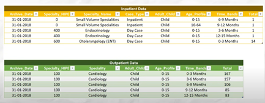

# 📊 Data Architecture

## 📁 Data Sources

The project leverages three main data sources:

```
📁 Data Sources
├── 📊 Inpatient Data (2018-2021)
│   ├── IN_WL_2018.csv
│   ├── IN_WL_2019.csv
│   ├── IN_WL_2020.csv
│   └── IN_WL_2021.csv
├── 📊 Outpatient Data (2018-2021)
│   ├── Op_WL_2018.csv
│   ├── Op_WL_2019.csv
│   ├── Op_WL_2020.csv
│   └── Op_WL_2021.csv
└── 📋 Mapping_Specialty.csv
```

- **Inpatient Data**: Stored in the Inpatient folder, with four CSV files representing data from 2018 to 2021. File names follow the format IN_WL_year (e.g., IN_WL_2018.csv). The four CSV files have the same number of columns and identical column headers.

- **Outpatient Data**: Stored in the Outpatient folder, with four CSV files representing data from 2018 to 2021. File names follow the format Op_WL_year (e.g., Op_WL_2018.csv). The four CSV files have the same number of columns and identical column headers.

- **Specialty Mapping Data**: A single CSV file named Mapping_Specialty.csv that maps specialties to broader specialty groups, enabling the creation of categories (buckets) for improved visualization and analysis.




## 📋 Data Dictionary

### 🏥 Inpatient and Outpatient Data

| Column name | Description | Data type | Example |
|-------------|-------------|-----------|---------|
| Archive_Date | The date when the record was archived. | DATE | 2021-12-31 |
| Specialty_HIPE | The HIPE (Hospital In-Patient Enquiry) code representing the specialty. | INTEGER | 101 |
| Specialty_Name / Specialty | The name of the medical specialty | TEXT | Cardiology |
| Case_Type | The type of case (e.g., "Inpatient" or "Day Case"). | TEXT | Inpatient |
| Adult_Child | Indicates whether the patient is an adult or a child. | TEXT | Adult |
| Age_Profile | Categorizes patients by age groups. | TEXT | 16-45 |
| Time_Bands | Categorizes patient waiting times. | TEXT | 3-6 months |
| Total | The total number of patients for the specified category. | TEXT | TEXT |

### ⚠️ Data Standardization Notes

We noticed the following differences between the inpatient and outpatient datasets:

- **Specialty_Name** (in inpatient) and **Specialty** (in outpatient) are two fields serving the same purpose. It would be better to standardize this column across both files and name it Specialty for consistency.
- **Case_Type** is only present in the inpatient data. To maintain consistency, we can add this column to the outpatient data and populate it with the value "Outpatient".

The **Archive_Date** column in both files is stored as text, not as a date. To convert it correctly, right-click the Archive_Date column, select Change Type > Using Locale, choose Date, and set the locale to French (France) for accurate conversion.

### 🗂️ Specialty Mapping Data

| Column name | Description | Data type | Example |
|-------------|-------------|-----------|---------|
| Specialty | The specific medical specialty. | TEXT | Cardiology |
| Specialty_Group | The broader category to which the specialty belongs. | TEXT | Heart |
