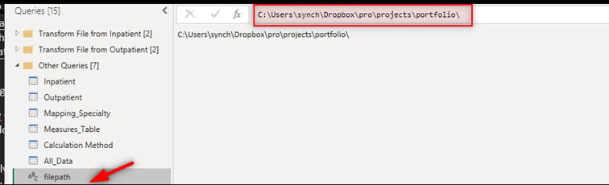
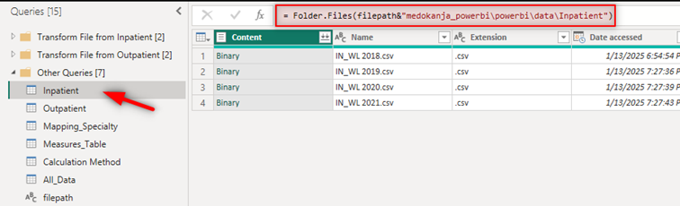
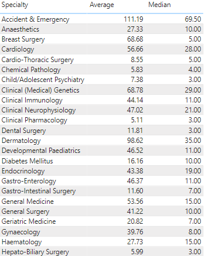
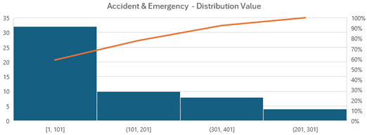
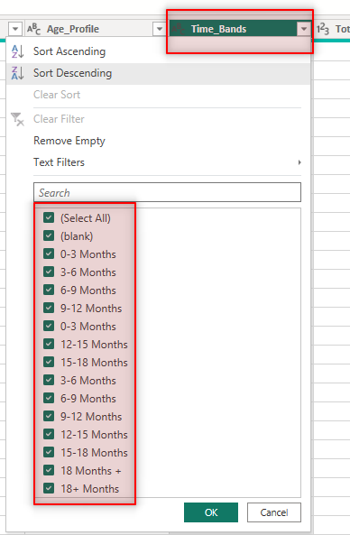
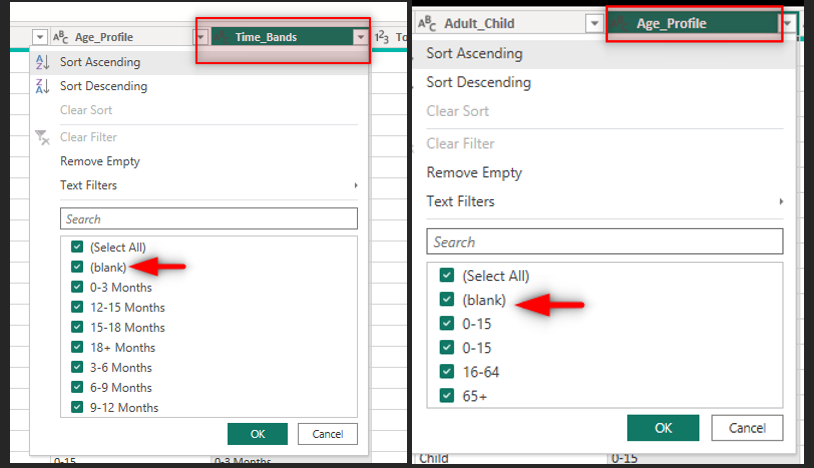

# 📊 Data Processing

## 📥 Load Data

The project dynamically uses the **filepath parameter** to locate data files across three main sources. This approach ensures flexibility and portability, allowing users to configure the file path based on their local system.

The filepath parameter is configured in Power Query to dynamically adjust the folder path. Users only need to update the filepath value to point to their local directory (e.g., `C:\Users\YourName\Documents\`), and all queries will automatically adapt to locate the data files.

Here is an example of the Inpatient Source configuration using the dynamic filepath parameter.

## ⚙️ Data Consolidation

1. **Combine** the four CSV files in each folder (Inpatient and Outpatient) into two tables: Inpatients and Outpatients.

2. **Standardize Columns**:
   - Rename the Specialty_Name and Specialty columns in both files to Specialty.
   - Add a new column, Case_Type, to the Outpatients table and populate it with the value "Outpatient".

3. **Append** the Inpatients and Outpatients tables into a new table named All_Data, while retaining the raw Inpatients and Outpatients tables for reference.

## 🔗 Relationship

Establish a relationship between the All_Data table and the Mapping_Specialty table using the common Specialty column, with a cardinality of One-to-Many (1:N) from the perspective of Mapping_Specialty to All_Data.

## 📈 Data Analysis

### 📊 Data Distribution, Average vs. Median

The dataset analysis indicates that the data is not normally distributed, as the mean, median are not close to each other. For example:

- Dermatology: Average = 99, Median = 35
- Accident & Emergency: Average = 111, Median = 69.5

*This distribution is not normal; it's right skewed with most values concentrated in the lower range.*

This highlights the presence of **outliers** and skewed distribution.

- **Average**: Sensitive to outliers, which can inflate or distort the central tendency.
- **Median**: Provides a more reliable central value in the presence of skewed data or extreme values.

Using median allows for better decision-making by focusing on the "middle ground" rather than being influenced by outliers.

For example, Dermatology's average (99) is inflated due to a few extreme values, whereas the median (35) offers a more accurate representation of typical waitlist times.

Including both average and median in the dashboard provides stakeholders with a dynamic view:

- Stakeholders can toggle between the metrics to understand how outliers impact their analysis.
- This flexibility helps in addressing different analytical needs and scenarios.

### ❗ Duplicate Data

We notice duplicated data in Time_Bands column (All_Data table) and this can cause issues in analysis and visualizations.

We notice the same in Age_Profile column.

The solution is to standardize these values using transformations like **Replace Values** or **Trim** to ensure consistency.

### ❓ Missing Values

Missing data in Time_Bands and Age_Profile appears as blank values, which can disrupt analysis. The solution is to replace blank values with a placeholder like "No Input" to maintain consistency and ensure the data is usable in visualizations.
