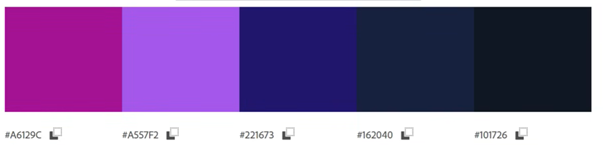
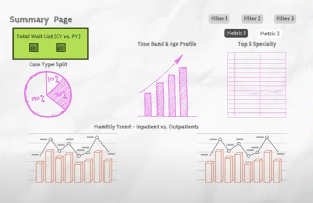
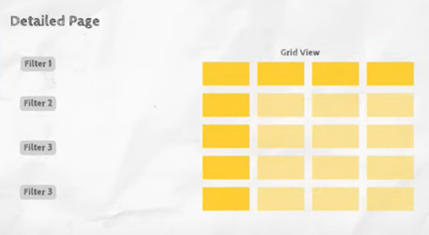

# 🖥️ Dashboard Design

## 🗂️ Design Blueprint

- Summary Page for an overall view of the data.
- A Detailed Page for granular analysis and deeper exploration.

Hex code used in this project:

## 📄 Summary Page

### 📊 Dynamic Measure: Average vs. Median

Create a dynamic measure to toggle between average and median. This was done using a slicer with options ("Average" and "Median") and a DAX measure using the SWITCH function. The dynamic measure changes based on the slicer selection, allowing users to switch between displaying the average and median values in the same chart. This approach provides flexibility for analyzing data with outliers.

### 🍩 Case Type Split

A donut chart is created to display the split by case type (e.g., inpatient, outpatient, day case). The chart uses a dynamic measure for average/median waitlist, allowing toggling between the two metrics. The case type field is added to the legend, and the chart dynamically updates based on user selections, providing an intuitive view of the waitlist distribution across case types.

### 📈 Waitlist by Time Bands & Age

A stacked column chart is created to display the average/median waitlist by time bands and age profile.

A dynamic measure is used to toggle between average and median values, allowing the chart to update based on user selection.

The time bands are added to the x-axis, age profile to the legend, and the dynamic measure to the y-axis.

Issues such as duplicate or inconsistent values (e.g., spaces or typos) in time bands and age profiles are cleaned during the transformation step to ensure accurate visualization.

### 🏥 Top 5 Specialties

A multi-row card is created to display the top 5 specialties based on the waitlist metric (average/median). A filter is applied to show only the top 5 specialties using the DAX measure for average/median waitlist. This allows stakeholders to focus on the key specialties with the highest wait times.

### 📅 Monthly trend – Inpatients vs. outpatients

A line chart is created to display the monthly trend of inpatients vs. outpatients.

- The archive date was added to the x-axis, and the total waitlist to the y-axis.
- The case type field was used in the legend to differentiate between inpatients, outpatients, and day cases.
- Separate line charts were created for inpatients/day cases and outpatients to provide a clearer view, and filters were applied to isolate the relevant case types for each chart.

### 🏷️ Dynamic title

A dynamic title is created to indicate whether average or median was selected.

- This was achieved using a DAX measure with the SWITCH function.
- The measure checks the user's selection from the toggle (slicer) and updates the title accordingly, displaying "Average Waitlist" or "Median Waitlist."
- The dynamic title ensures clarity for users by explicitly showing which metric is currently displayed in the charts.

## 📜 Detailed Page

A detail page to display granular-level data is created. Key points include:

- A matrix visualization was used to show detailed data with rows for attributes like specialties and columns for case types (e.g., inpatient, outpatient).
- Filters for time bands, age profiles, and other dimensions were added on the left for better interactivity.

## 🔄 Interactive Views

- Navigation buttons were added to switch between the summary page and the detail page for seamless user experience.
- Advanced formatting and interactivity, like synced filters, were implemented to ensure consistency across pages.
